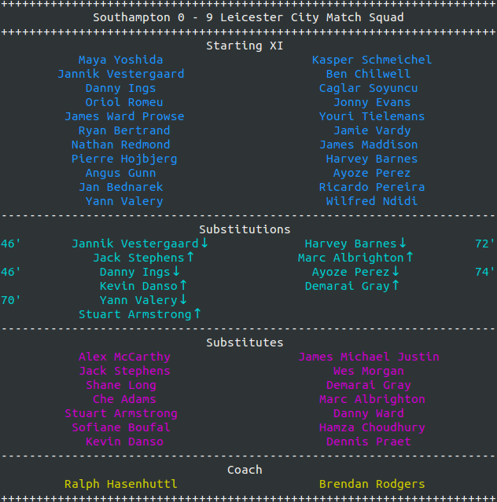

## football_shell
A handy script to get football scores from terminal.

### Requirements
- python3+
- BeautifulSoup4
- Requests

### Usage
```
git clone https://github.com/hunterwyld/football_shell.git
cd football_shell
python fs_main.py
```

### Features
#### show league tables


#### show live scores


#### show match detail


#### show match squad



#### show match statistics


### Supported Leagues
- [England] Premier League
- [England] Championship
- [England] League 1
- [England] League 2
- [Spain] LaLiga
- [Spain] LaLiga SmartBank
- [Italy] Serie A
- [Italy] Serie B
- [Germany] Bundesliga
- [Germany] 2nd Bundesliga
- [France] Ligue 1
- [France] Ligue 2
- [Netherlands] Eredivisie
- [Portugal] Primeira Liga
- [Russia] Premier League
- [China] Super League
- [Japan] J. League
- [Australia] Hyundai A-League


> Data collected from www.livescores.com